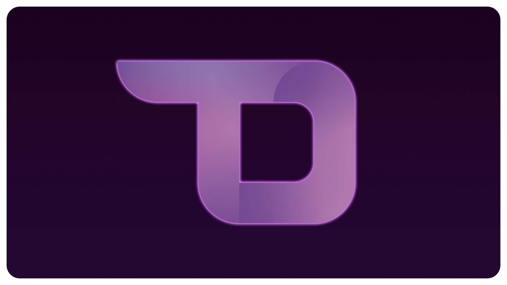

<h1 align='center'>Flask To Do List</h1>

[](http://gk-flask-to-do.herokuapp.com/)

<div align='center'>

|[Enlace a página web](http://gk-flask-to-do.herokuapp.com/)|
|---|

</div>

<details open>
<summary>Tabla de Contenidos:</summary>
<ol>
<li><a href="#sobre-el-proyecto">Sobre el proyecto</a>.</li>
<li><a href="#objetivos-del-proyecto">Objetivos del proyecto</a>.</li>
<li><a href="#herramientas-utilizadas">Herramientas utilizadas</a>.</li>
<li><a href="#como-usar">Como usar</a>.</li>
<li><a href="##visión-a-futuro">Visión a futuro</a>.</li>
</ol>
</details>

## Sobre el proyecto

Aplicación web que funciona como una lista de tareas, que posee un sistema de usuarios y con ello la capacidad de agregar a otros usuarios como amigos.

Además:

- Varias listas por usuario.
- Poder visualizar listas de otros usuarios y su progreso.
- Mostrar actualizaciones del progreso de amigos en el Feed de Actividad.

## Objetivos del proyecto

Este proyecto se realizó para:

- Entrenar habilidades de desarrollo Front End con CSS y JS.
- Aprender y familiarizarse con Back End y prácticas usuales u óptimas.
- Entrenar el diseño y construccion de bases de datos SQL.

Posibles añadidos al proyecto pueden ser:

- Ajustar visibilidad de listas especificas de usuario.
- Mensajería entre usuarios amigos.

## Herramientas utilizadas

### Front End


### Back End


### Deployment


## Como usar

Para empezar, se requiere `python>=3.7.7`.

### Para pruebas locales

Para esto, primero hay que clonar el repositorio:
```bash
$ git clone https://github.com/GianK128/Flask-To-Do-List
$ cd Flask-To-Do-List/
```

Se recomienda crear un entorno virtual de python para el proyecto, si se usa `venv`:
```bash
$ python3 -m venv my_venv
$ source my_venv/bin/activate
```

Y luego instalar las dependencias:
```bash
$ pip install -r requirements.txt
```

Conviene crear un archivo `.env` en la carpeta raíz del proyecto, con las variables de entorno vitales para la aplicación:
```
# .env

APP_SECRET_KEY=my_secret_key
APP_SECURITY_PASSWORD_SALT=my_password_salt
APP_MAIL_USERNAME=mail@example.com
APP_MAIL_PASSWORD=password_token
```

Y luego establecer una manera de cargarlas dentro del programa, en este caso, con el modulo `dotenv`:
```bash
$ pip install python-dotenv
```

Y luego en el archivo `__init__.py`, cargar las variables:
```python
# todo_list/__init__.py
# imports...
from dotenv import load_dotenv

load_dotenv()

# construir app...
```

Entonces, ya podríamos realizar el ante-último paso, y crear la base de datos con el archivo ya creado:
```bash
$ python3 create_database.py
```

Y ya se debería poder correr la aplicación:
```bash
$ python3 run.py
```

## Visión a futuro

Revisitaré este proyecto en el futuro para:
- Corregir errores publicados en **Issues**.
- Hacer un diseño CSS Responsive con un acercamiento Mobile-First.
- Convertir el back end a una API REST y manejar todo con solicitudes desde JS.
- Convertir el front end a una aplicación de React.
- Agregar las funcionalidades descritas en [Objetivos del proyecto](#objetivos-del-proyecto).